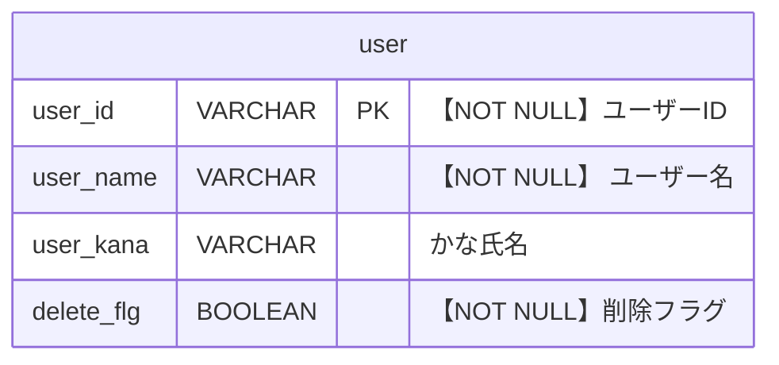

# 1. spring-hsqldb-rest-demo
Spring Boot HSQLDB 使用デモ（RestController使用）

- [1. spring-hsqldb-rest-demo](#1-spring-hsqldb-rest-demo)
- [2. 初期構築](#2-初期構築)
  - [2.1. 事前準備](#21-事前準備)
  - [2.2. Spring Boot プロジェクト作成](#22-spring-boot-プロジェクト作成)
    - [2.2.1. Spring Initializr による初期ファイル作成](#221-spring-initializr-による初期ファイル作成)
  - [2.3. VSCode の設定 （初回のみ）](#23-vscode-の設定-初回のみ)
    - [2.3.1. 【任意】プロファイルの作成](#231-任意プロファイルの作成)
    - [2.3.2. 拡張機能のインストール](#232-拡張機能のインストール)
  - [2.4. 実行のための最低限のファイルの配置](#24-実行のための最低限のファイルの配置)
    - [2.4.1. HelloController.java の作成](#241-hellocontrollerjava-の作成)
- [3. アプリケーション実行手順](#3-アプリケーション実行手順)
  - [3.1. 実行開始](#31-実行開始)
  - [3.2. ブラウザ確認](#32-ブラウザ確認)
  - [3.3. 停止する場合](#33-停止する場合)
- [4. 開発完了後の本番用資材作成手順](#4-開発完了後の本番用資材作成手順)
  - [4.1. 本番用資材作成（ビルド）](#41-本番用資材作成ビルド)
  - [4.2. 本番用資材配置（デプロイ）・実行](#42-本番用資材配置デプロイ実行)
- [5. DBを使用した処理の実装](#5-dbを使用した処理の実装)
  - [5.1. エンティティの作成](#51-エンティティの作成)
  - [5.2. リポジトリの作成](#52-リポジトリの作成)
  - [5.3. その他のクラスの作成](#53-その他のクラスの作成)
    - [5.3.1. サービス・コントローラー](#531-サービスコントローラー)
    - [5.3.2. DTO（データ保持のためのクラス）](#532-dtoデータ保持のためのクラス)
  - [5.4. 今回の処理内容とエンドポイント](#54-今回の処理内容とエンドポイント)
    - [5.4.1. 【GET】 /api/v1/users/USER001](#541-get-apiv1usersuser001)
    - [5.4.2. 【POST】 /api/v1/users](#542-post-apiv1users)
    - [5.4.3. 【PUT】 /api/v1/users](#543-put-apiv1users)
    - [5.4.4. 【DELETE】 /api/v1/users/USER001](#544-delete-apiv1usersuser001)
    - [5.4.5. 【GET】 /api/v1/users](#545-get-apiv1users)
    - [5.4.6. 【GET】 /api/v1/users?activeOnly=true](#546-get-apiv1usersactiveonlytrue)


# 2. 初期構築
## 2.1. 事前準備
- VS Code をインストールする
- Java をインストールする

## 2.2. Spring Boot プロジェクト作成
### 2.2.1. Spring Initializr による初期ファイル作成
1. Spring Initializr (https://start.spring.io/) にアクセスする
2. 以下の内容を設定し、 GENERATE ボタンで zip をダウンロードする
    - 設定内容
        - Project : Maven
        - Language : Java
        - Spring Boot : 3.4.4 (※選択肢で「SNAPSHOT」や「M3」でない最新にするのが無難)
        - Project Metadata
            - Group : （※例：com.example）
            - Artifact : （※例：spring-hsqldb-rest-demo）
            - Name : （※Artifactの内容から自動で設定される）
            - Description : （※例：Demo project for Spring Boot）
            - Package name : （※GroupとArtifactの内容から自動で設定される）
            - Packaging: Jar
            - Java : 21（※インストール済みのJavaに合わせる）
        - Dependencies
            - Spring Web (補足：WEBサーバー開発に必須)
            - Spring Boot Dev Tools (補足：便利系)
            - Lombok (補足：便利系)
            - Spring Data JPA （補足：DBとのアクセスに必要）
            - HyperSQL Database （補足：今回DBとして使用するHSQLDB）


3. ダウンロード後、zipを解凍する。一時的な使用でない場合は、解凍後のフォルダを任意の場所に移動する
4. フォルダを VS Code で開く
   - Gitで管理する場合は、この段階でクローン済みのフォルダ内に移動する

## 2.3. VSCode の設定 （初回のみ）
### 2.3.1. 【任意】プロファイルの作成
Javaの拡張機能をインストールすると、余計なアイコンなどが増え、
Java以外の用途では邪魔に感じることがある可能性がある。
そういった場合は、「プロファイル」機能を利用し、
用途によってVSCodeの設定を切り替えるといった使い方ができる。
その場合は新しくプロファイルを作成する。（プロファイル名の例：Java）

### 2.3.2. 拡張機能のインストール
次の拡張機能をインストールする

- Extension Pack for Java
    - ID: vscjava.vscode-java-pack
- Spring Boot Extension Pack
    - ID: vmware.vscode-boot-dev-pack
- Gradle Extension Pack （※今回は任意。MavenではなくGradleを使用する場合にインストールする）
    - ID: richardwillis.vscode-gradle-extension-pack
- 【任意】 IntelliCode （定番のコード支援拡張機能）
  - ID: VisualStudioExptTeam.vscodeintellicode


## 2.4. 実行のための最低限のファイルの配置
- アプリケーションを実行させるために、次のファイルを指定場所に作成する

### 2.4.1. HelloController.java の作成
- 以下の内容のファイルを作成する
- 格納ディレクトリ: `src/main/java/com/example/spring_hsqldb_rest_demo/`
- ファイル名: `HelloController.java`

```java
package ※ファイル作成時に自動で設定される;

import org.springframework.web.bind.annotation.RestController;
import org.springframework.web.bind.annotation.GetMapping;

@RestController
public class HelloController {
    
    @GetMapping("/")
    public String index() {
        return "Hello Spring Boot!!";
    }
    
}
```

- 完了後、次のアプリケーション実行の手順に進む


# 3. アプリケーション実行手順
## 3.1. 実行開始
1. 何らかのJavaファイルを開いている状態で F5キー を押す
2. VSCode内でターミナルが起動し、ターミナル内に以下のような表示が出て、実行状態となっていることを確認する
  - VSCode の右上に、「再起動」や「停止」などのコントロール用のバーが出ていれば実行状態

```
  .   ____          _            __ _ _
 /\\ / ___'_ __ _ _(_)_ __  __ _ \ \ \ \
( ( )\___ | '_ | '_| | '_ \/ _` | \ \ \ \
 \\/  ___)| |_)| | | | | || (_| |  ) ) ) )
  '  |____| .__|_| |_|_| |_\__, | / / / /
 =========|_|==============|___/=/_/_/_/
```

3. ターミナルの表示の下から2行目あたりに `Tomcat started on port 8080 (http) with context path '/'` のような文言があることを確認する

## 3.2. ブラウザ確認
1. WEBブラウザを開き、`http://localhost:8080/` を開く (ターミナルで確認した文言が 8080 でない場合は、URLをその数値に合わせる)
2. ページの内容が表示され、 `HelloController` で作成した、 `Hello Spring Boot!!` の文字が表示されればOK

## 3.3. 停止する場合
1. VSCode の右上に表示されているコントロール用のバーの「停止」を押す
   - ターミナル上で `Ctrl + C` でもOK。


# 4. 開発完了後の本番用資材作成手順
## 4.1. 本番用資材作成（ビルド）
1. VSCodeのエクスプローラービューの下側の MAVEN を項目を開き、 プロジェクト名 > Lifecycle > package を押す
2. ビルドが始まるので終了するまで待つ
3. 終了後、 `target` ディレクトリの配下に `プロジェクト名-X.X.X-SNAPSHOT.jar` ファイルが作成されていることを確認する

## 4.2. 本番用資材配置（デプロイ）・実行
1. 配置するサーバー上の任意の場所に、ビルドしたJARファイルを配置する
2. `java -jar 配置したJARファイル` コマンドで実行する（ `Ctrl + C` で終了）


# 5. DBを使用した処理の実装
DBを使用するにあたって、以下のクラスを作成する。

- エンティティ
  - DBのデータを格納して使用するためのクラス
  - 普通、テーブル単位で作成する
- リポジトリ
  - DBにアクセスするための専用クラス
  - 普通、テーブル単位で作成する

今回、デモ用として以下のようなテーブルの利用を想定する。

**ユーザーテーブル**



## 5.1. エンティティの作成
- 以下の内容のファイルを作成する
- 格納ディレクトリ: `src/main/java/com/example/spring_hsqldb_rest_demo/`
- ファイル名: `User.java`

```java
package ※ファイル作成時に自動で設定される;

import jakarta.persistence.Column;
import jakarta.persistence.Entity;
import jakarta.persistence.Id;
import lombok.Data;

@Data
@AllArgsConstructor
@NoArgsConstructor
@Entity
@Table(name = "user")
public class User {
    
    @Id
    @Column
    private String userId;
    
    @Column(nullable = false)
    private String userName;
    
    @Column(nullable = true)
    private String userKana;
    
    @Column(nullable = false)
    private Boolean deleteFlg;
}
```

**補足**
- エンティティのクラスには `@Entity` をつける。通常はクラス名がテーブル名として認識される。
- `@Table(name = "テーブル名")` とつけると、明示的にテーブル名を指定できる（クラス名とテーブル名を分けたい場合など）
  - 上記の場合は本来は不要。今回はわかりやすくするために付与。
- エンティティは、ゲッター・セッターなどでカプセル化されたクラスにする必要があるが、
  Lombokの以下のアノテーションで自動生成している
  - `@Data` ： ゲッター・セッターの自動生成
  - `@AllArgsConstructor` ： コンストラクタ（メンバ変数に対する全引数あり）の自動生成
  - `@NoArgsConstructor` ： コンストラクタ（引数なし）の自動生成
- 各メンバー変数は、 `@Column` をつけることにより、DBのテーブルの「列」になる。
  テーブルの列名は、自動的にケースの変換が行われる（例：userId ←→ user_id）
- `@Column` にある `(nullable = false)` は、 その列が NOT NULL かどうかをあることを表している。
  （例： `nullable = false` → NULLは入らない → NOT NULL）
- `@Id` は、その列が主キー（PK）であることを表している


## 5.2. リポジトリの作成
- 以下の内容のファイルを作成する
- 格納ディレクトリ: `src/main/java/com/example/spring_hsqldb_rest_demo/`
- ファイル名: `UserRepository.java`

```java
package ※ファイル作成時に自動で設定される;

import java.util.List;

import org.springframework.data.jpa.repository.JpaRepository;
import org.springframework.stereotype.Repository;

@Repository
public interface UserRepository extends JpaRepository<User, String> {
    
    List<User> findAllByDeleteFlg(Boolean deleteFlg);
}

```

**補足**
- リポジトリは `@Repository` をつけた、インタフェースにする。
- インタフェースは、 `JpaRepository<T, ID>` を継承（extends）する。
  - `T` には、テーブルで使用するエンティティのクラスを指定する（ここでは `User` クラス）
  - `ID` には、主キー（PK）となる列の型（エンティティで `@Id` に指定した列の型）を指定する（ここでは `String`）
- 継承した時点で、多くのメソッドが含まれるため、基本的なDB操作であれば、中の記述は不要
- 今回は継承に含まれていない、SQLのクエリを使用するため、 `findAllByDeleteFlg` を定義している


## 5.3. その他のクラスの作成
### 5.3.1. サービス・コントローラー
- `UserService.java` → サービスのクラス。
- `UserController.java` → コントローラーのクラス。

Controller → Service → Repository → DB の順にアクセスされる

### 5.3.2. DTO（データ保持のためのクラス）
- `UserRequest.java` → コントローラーがユーザーデータを受け取るために作ったクラス
- `UserResponse.java` → コントローラーがユーザーデータを返すために作ったクラス
- `UserResponseList.java` → コントローラーが複数のユーザーデータを返すために作ったクラス
- `ProcessResultResponse.java` → コントローラーが処理結果を返すために作ったクラス


## 5.4. 今回の処理内容とエンドポイント
今回の処理内容とエンドポイントは以下の通り。  
確認する際は、 APIのクライアントソフトなどで、 `http://localhost:8080` をつけて実行します。

例： `/api/v1/users` → `http://localhost:8080/api/v1/users`


### 5.4.1. 【GET】 /api/v1/users/USER001
- 「USER001」のユーザー情報を取得
- 「USER001」部分は好きに指定可能
- 対応コントローラー： `UserController` クラスの `fetchUser` メソッド

### 5.4.2. 【POST】 /api/v1/users
- ユーザーデータを登録
- リクエスト時、 BodyにユーザーデータをJSONで指定することで、そのユーザーデータを登録することができる
- 対応コントローラー： `UserController` クラスの `addUser` メソッド

**Bodyの指定例（ヘッダーの Content-Type は application/json にする）**

```json
{
    "userId": "ID001",
    "userName": "テスト太郎1",
    "userKana": "てすとたろう1",
    "isDelete": false
}
```

### 5.4.3. 【PUT】 /api/v1/users
- ユーザーデータを更新
- リクエスト時、 BodyにユーザーデータをJSONで指定することで、そのユーザーデータを更新することができる
- 対応コントローラー： `UserController` クラスの `updateUser` メソッド

**Bodyの指定例（ヘッダーの Content-Type は application/json にする）**

```json
{
    "userId": "ID001",
    "userName": "テスト太郎1",
    "userKana": "てすとたろう1",
    "isDelete": true
}
```

### 5.4.4. 【DELETE】 /api/v1/users/USER001
- 「USER001」のユーザー情報を削除
- 「USER001」部分は好きに指定可能
- 対応コントローラー： `UserController` クラスの `deleteUser` メソッド

### 5.4.5. 【GET】 /api/v1/users
- 全ユーザーの情報を取得
- 対応コントローラー： `UserController` クラスの `fetchAllUser` メソッド

### 5.4.6. 【GET】 /api/v1/users?activeOnly=true
- アクティブな全ユーザーの情報を取得（削除フラグが1でないユーザー）
- 対応コントローラー： `UserController` クラスの `fetchAllUser` メソッド

